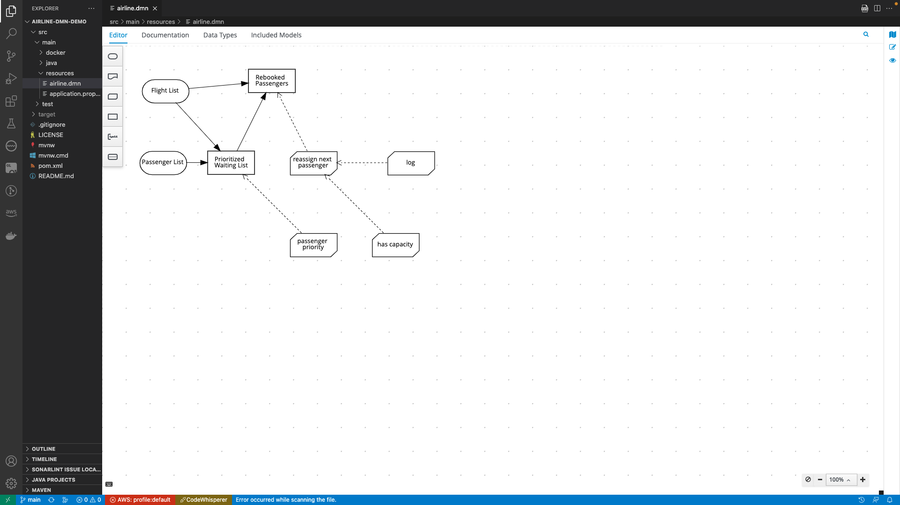

# airline-dmn-demo

This project uses Quarkus, the Supersonic Subatomic Java Framework.

If you want to learn more about Quarkus, please visit its website: https://quarkus.io/ .

## Running the application in dev mode

You can run your application in dev mode that enables live coding using:
```shell script
./mvnw compile quarkus:dev
```

> **_NOTE:_**  Quarkus now ships with a Dev UI, which is available in dev mode only at http://localhost:8080/q/dev/.

## Packaging and running the application

The application can be packaged using:
```shell script
./mvnw package
```
It produces the `quarkus-run.jar` file in the `target/quarkus-app/` directory.
Be aware that it’s not an _über-jar_ as the dependencies are copied into the `target/quarkus-app/lib/` directory.

The application is now runnable using `java -jar target/quarkus-app/quarkus-run.jar`.

If you want to build an _über-jar_, execute the following command:
```shell script
./mvnw package -Dquarkus.package.type=uber-jar
```

The application, packaged as an _über-jar_, is now runnable using `java -jar target/*-runner.jar`.

## Creating a native executable

You can create a native executable using: 
```shell script
./mvnw package -Pnative
```

Or, if you don't have GraalVM installed, you can run the native executable build in a container using: 
```shell script
./mvnw package -Pnative -Dquarkus.native.container-build=true
```

You can then execute your native executable with: `./target/airline-dmn-demo-1.0.0-SNAPSHOT-runner`

If you want to learn more about building native executables, please consult https://quarkus.io/guides/maven-tooling.

## Related Guides

- Kogito - Decisions (DMN) ([guide](https://quarkus.io/guides/kogito-dmn)): Add Kogito decision (DMN) capabilities - Include Drools DMN engine
- Red Hat Airline Example (DMN) ([example](https://access.redhat.com/documentation/en-us/red_hat_process_automation_manager/7.12/html/developing_decision_services_in_red_hat_process_automation_manager/dmn-con_dmn-models#dmn-model-example-ref_dmn-models))


##  Red Hat Airline Example

The following is a real-world DMN model example that demonstrates how you can use decision modeling to reach a decision based on input data, circumstances, and company guidelines. In this scenario, a flight from San Diego to New York is canceled, requiring the affected airline to find alternate arrangements for its inconvenienced passengers.

First, the airline collects the information necessary to determine how best to get the travelers to their destinations:

### Input data
- List of flights
- List of passengers

### Decisions
- Prioritize the passengers who will get seats on a new flight
- Determine which flights those passengers will be offered

### Business knowledge models
- The company process for determining passenger priority
- Any flights that have space available
- Company rules for determining how best to reassign inconvenienced passengers

The airline then uses the DMN standard to model its decision process in the following decision requirements diagram (DRD) for determining the best rebooking solution:

### DRD in Visual Studio code with Kogito Plugin


### Curl command to test
```bash
curl -X POST -H "Content-Type: application/json" -d @./src/test/resources/json/rebook2Pax2Flights.json http://localhost:8080/airline | json_pp
```

### Sample request
```
{
    "Passenger List": [
        {
            "Flight Number": "1234",
            "Status": "silver",
            "Miles": 1024,
            "Name": "Silver Passenger"
        },
        {
            "Flight Number": "1234",
            "Status": "gold",
            "Miles": 1024,
            "Name": "Gold Passenger"
        },
        {
            "Flight Number": "1234",
            "Status": "bronze",
            "Miles": 1024,
            "Name": "Bronze Passenger"
        }
    ],
    "Flight List" : [
        {
            "Flight Number": "1234",
            "From":"SAN",
            "To":"JFK",
            "Departure": "2023-05-24T09:00:00@EST",
            "Arrival": "2023-05-24T11:00:00@EST",
            "Capacity": 0,
            "Status" : "cancelled"

        },
        {
            "Flight Number": "4321",
            "From":"SAN",
            "To":"JFK",
            "Departure": "2023-05-24T12:00:00@EST",
            "Arrival": "2023-05-24T14:00:00@EST",
            "Capacity": 2,
            "Status" : "scheduled"

        },
         {
            "Flight Number": "4325",
            "From":"SAN",
            "To":"JFK",
            "Departure": "2023-05-24T14:00:00@EST",
            "Arrival": "2023-05-24T16:00:00@EST",
            "Capacity": 1,
            "Status" : "scheduled"

        }
    ]
}
```
### Sample response
```
{
    "Prioritized Waiting List": [
        {
            "Flight Number": "1234",
            "Status": "gold",
            "Miles": 1024,
            "Name": "Gold Passenger"
        },
        {
            "Flight Number": "1234",
            "Status": "silver",
            "Miles": 1024,
            "Name": "Silver Passenger"
        },
        {
            "Flight Number": "1234",
            "Status": "bronze",
            "Miles": 1024,
            "Name": "Bronze Passenger"
        }
    ],
    "has capacity": "function has capacity( flight, rebooked list )",
    "log": "function log( logStr )",
    "Passenger List": [
        {
            "Flight Number": "1234",
            "Status": "silver",
            "Miles": 1024,
            "Name": "Silver Passenger"
        },
        {
            "Flight Number": "1234",
            "Status": "gold",
            "Miles": 1024,
            "Name": "Gold Passenger"
        },
        {
            "Flight Number": "1234",
            "Status": "bronze",
            "Miles": 1024,
            "Name": "Bronze Passenger"
        }
    ],
    "passenger priority": "function passenger priority( Passenger1, Passenger2 )",
    "Rebooked Passengers": [
        {
            "Status": "gold",
            "Miles": 1024,
            "Flight Number": "4321",
            "Name": "Gold Passenger"
        },
        {
            "Status": "silver",
            "Miles": 1024,
            "Flight Number": "4321",
            "Name": "Silver Passenger"
        },
        {
            "Status": "bronze",
            "Miles": 1024,
            "Flight Number": "4325",
            "Name": "Bronze Passenger"
        }
    ],
    "Flight List": [
        {
            "Flight Number": "1234",
            "Status": "cancelled",
            "Departure": "2023-05-24T09:00:00@EST",
            "Capacity": 0,
            "From": "SAN",
            "To": "JFK",
            "Arrival": "2023-05-24T11:00:00@EST"
        },
        {
            "Flight Number": "4321",
            "Status": "scheduled",
            "Departure": "2023-05-24T12:00:00@EST",
            "Capacity": 2,
            "From": "SAN",
            "To": "JFK",
            "Arrival": "2023-05-24T14:00:00@EST"
        },
        {
            "Flight Number": "4325",
            "Status": "scheduled",
            "Departure": "2023-05-24T14:00:00@EST",
            "Capacity": 1,
            "From": "SAN",
            "To": "JFK",
            "Arrival": "2023-05-24T16:00:00@EST"
        }
    ],
    "reassign next passenger": "function reassign next passenger( Waiting List, Reassigned Passengers List, Flights )"
}

```